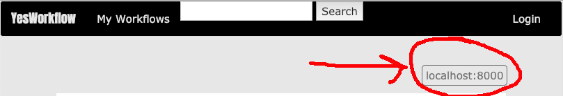

# YesWorkflow Web Components ReadMe/Getting Started Guide

## Prerequisites: 
### Required:
* Python 3.5 or greater
* Pip for the installed Python3 environment
* [Clone the YesWorkflow Web Components Repository](https://github.com/aniehuser/senior-design-group10)
* Install project dependencies by executing `pip install -r requirements.txt`

### Optional:
The YesWorkflow Web Components Repository comes with an already packaged YesWorkflow Jar file that can be used to save work to the website. This Jar files is found at the root of the project directory.

To see the source code for the CLI Java tool, go to the [YesWorkflow Prototypes Repository](https://github.com/aniehuser/yw-prototypes).

For more detailed instruction on how to begin using and developing the CLI please see the README found within this repository.

## Installation:
After installing all prerequisites navigate to the folder in the cloned website repository labeled scripts. To quickly launch the website execute *deploy_python3.sh* if on MacOS or Linux. If on a Window's environment execute *deploy_python.sh*. Note that these two files are simply a collection of bash commands that will initialize and begin running the YesWorkflow Web Components website. 

If unable to run these bash files, the Python3 commands inside can be executed separately through the terminal.

For documentation on the commands found in these files please see the [Django documentation](https://docs.djangoproject.com/en/2.1/).

## Key Terms:
* Workflows - A visual representation of a script's main functions that shows the flow of data throughout the program.
* Versions - A distinctly different version of a workflow. Versions are used to distinguish when a workflow has been updated in any way.
* Runs - A run through of data inputs on a specific version of a specific workflow. Runs show inputs and outputs into a script and help give a better understanding of where data is being handled and manipulated
* Tags - optional identifying keywords

## CLI Tool
### YesWorkflow Save Command and Configurations
Note: To use the jar file please install the following prequisite:
* Java (JRE) version 1.10

The Jar file will need to be executed from the terminal and can be found at the root folder of the YesWorkflow Web Components repository.

YesWorkflow CLI's Save command works by executing and aggregating all YesWorkflow commands and then sending important data up to your deployed YesWorkflow WebComponents instance. To use, type in the command prompt below

### Example usage:
In this example my_scripty.py is a python file that contains YesWorkflow annotations. The commands will work the same on any .matlab or .R files that contain YesWorkflow annotations.

```
java -jar yesworkflow.jar save my_scripty.py
```

You can set configurations manually in the command prompt
```
java -jar yesworkflow.jar save my_scripty.py -c save.serveraddress=http://localhost:8000/
```

For multiple manual configurations, use `-c` flag again
```
java -jar yesworkflow.jar save my_scripty.py -c save.serveraddress=http://localhost:8000/ -c graph.dotfile=out.txt
```

or you can set configurations in a text file named `yw.properties` that you must place in the same directory as your yesworkflow jar file.

```
## Example File Contents ##

save.serveraddress=http://localhost:8000/
save.username=my_username
```

Required configurations to use YesWorkflow Save
+ save.serveraddress *(Only if you are using a YesWorkflow WebComponents that is not hosted on your localhost port 8000)*
+ save.username

#### save.serveraddress

**REQUIRED - Usually**

Set `save.serveraddress` to the DNS/IP address/URL of the server you would like to save a workflow's run to. 
You can view what the server address to set the configuration on YesWorkflow WebComponents instance's Home Page. 


**NOTE** :: YesWorkflow Save is currently a bit finicky, so, in this example, to save a workflow's run to `localhost:8000` as shown, you would need to include the `http://` before the dns, as well as a trailing `/`. It would look something like `save.serveraddress=http://localhost:8000/`

#### save.username

**REQUIRED**

For security purposes, you must also specify that you are a valid user on the server that you have specified in `save.serveradress`.

To upload a workflow's run, you as a user must first create a new account on the YesWorkflow WebComponents instance you would like to save to. Then, you must specify your username in using this configuration. If your user name is *"george_danger"*, you would have a configuration like `save.username=george_danger`.

#### save.workflow

To create a new, fresh workflow, make sure that no configuration is set for `save.workflow`.

To add a run to an existing workflow, specify the workflow's id. For a workflow with an id of 1
```
save.workflow=1 
```

#### save.title

This is an optional field to set or update the title of a workflow.
```
save.title=This is an example title for a workflow
```


#### save.description

This is an optional field to set or update the description of a workflow.
```
save.description=This is an example description for a workflow
```

#### save.tags

This is a comma delimited list of tags you want to set or update the tags of a workflow.
```
save.tags=fun,science,bill-nye
```

#### Some things to note

YesWorkflow save calls all subsequent commands (extract, model, graph, recon). When calling graph, by default, there will be a dump of a graphviz string to terminal output. To hide this output when calling YesWorkflow save, it's recommended that you use the following configuration
```
graph.dotfile=out.txt
```

This puts the graphviz string into a file so you can see 'save' related content.


## Website Navigation
YesWorkflow Web Components has three major pages. The Home page, which contains a list of all workflows uploaded to the website. To view only the workflows associated with the currently logged in user, click the My Workflows tab. 


To navigate back to the homepage, click the YesWorkflow logo in the top left corner.

On the Home page and My Workflows page one can enter a query into the search bar and filter workflows that are relevant to the search entry.

By clicking on a workflow found on either the Home page or the My Workflows page you will be navigated to a more detailed view of the workflow. 


The next page you will see is the detailed workflow page. If you are the owner of this workflow you will have extra privileges, such as editing and deleting the workflow.

You can select different versions of the workflow with the version dropdown. 

To navigate to a more detailed view of a run, click on one of the runs found in the list of runs. This run page will contain more details about the files associated with the run.


Currently the run page is a work in progress but once finished it will contain parsed information about the files found when the save command is executed. 


